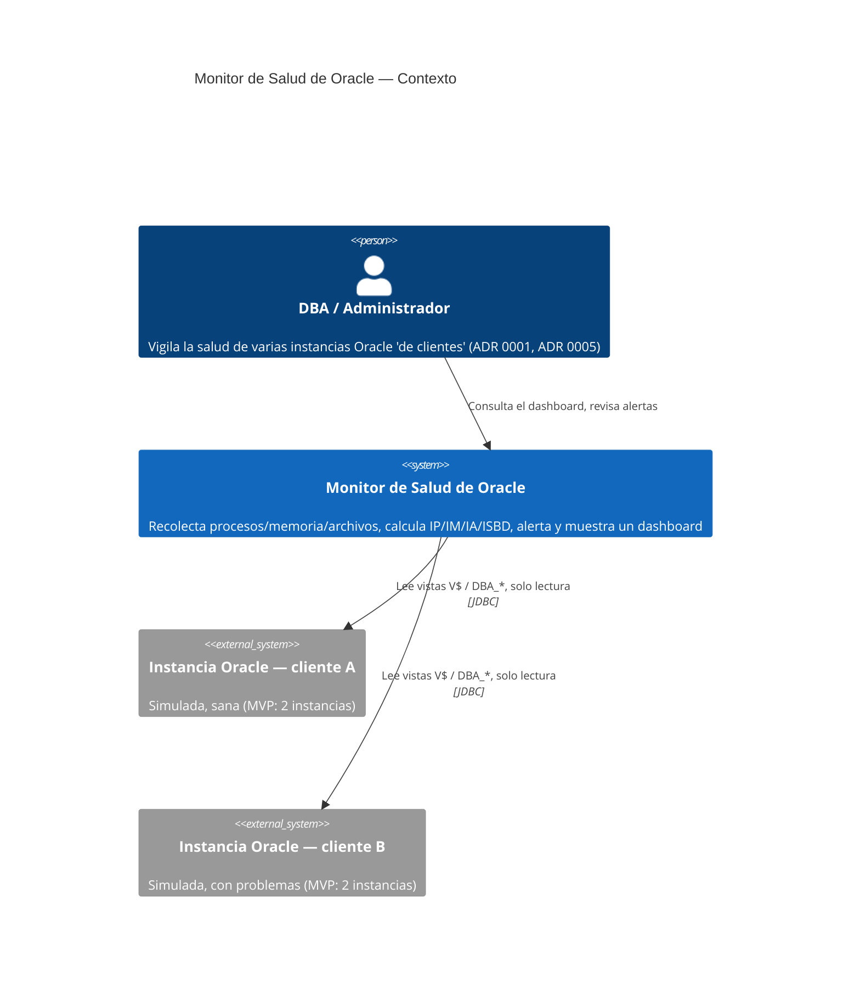

# C4 — Nivel 1: Contexto

Notas:

- El monitor nunca escribe en las instancias monitoreadas (pool `readOnly=true`,
  ver `references/estructura-backend.md` de la skill de arquitectura).
- El histórico del propio monitor vive en PostgreSQL, no en las instancias
  Oracle observadas — ver ADR 0002. No aparece en este nivel porque es un
  contenedor interno del sistema, no un actor externo; se detalla en el
  diagrama de Nivel 2 (Contenedores, pendiente).
